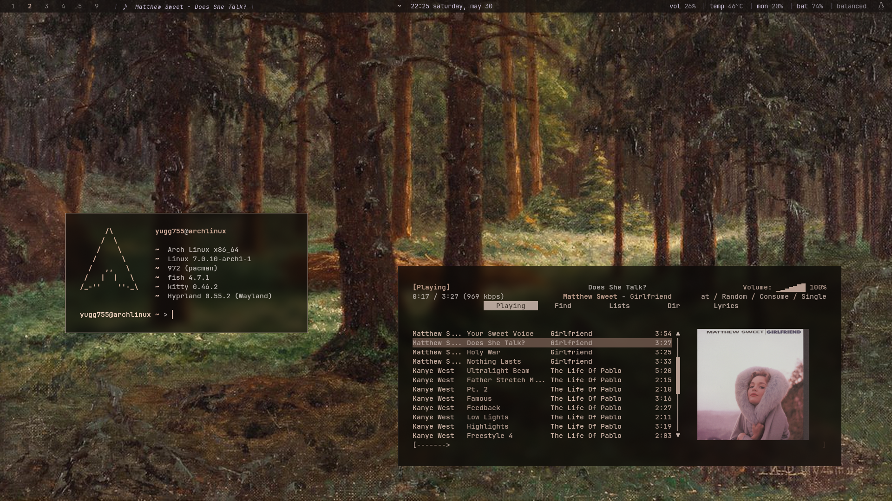

## personal-dotfiles

my personal linux setup and dotfiles.

## contents

- [preview](#screenshots)
- [components](#components)
- [structure](#structure)
- [installation](#installation)
- [wallpaper sources](#wallpaper-sources)
- [credits](#credits)
- [notes](#notes)
- [reuse](#reuse)
  
## screenshots



## components

* **os** → Arch Linux
* **wm** → Hyprland
* **terminal** → Kitty
* **shell** → Fish
* **bar** → Waybar
* **launcher** → Rofi
* **notifications** → SwayNC
* **osd** → SwayOSD
* **editor** → Neovim
* **file manager** → Yazi + Nautilus
* **music** → MPD + rmpc
* **pdf viewer** → Zathura
* **colors** → Matugen
* **wallpaper** → awww
* **theming** → GTK
* **utilities** → btop, Fastfetch

## structure

```text
dotfiles/
├── btop
├── fastfetch
├── fish
├── gtk-3.0
├── gtk-4.0
├── hypr
├── kitty
├── matugen
├── micro
├── mpd
├── nvim
├── rmpc
├── rofi
├── scripts
├── swaync
├── swayosd
├── waybar
├── yazi
├── zathura
└── screenshots
```

## installation

### clone the repository

```bash
git clone https://github.com/yugg755i/dotfiles.git
cd dotfiles
```

### install dependencies

```bash
sudo pacman -S hyprland kitty fish rofi waybar swaync swayosd yazi micro fastfetch btop mpd rmpc zathura stow python
```

aur packages:

* `matugen`
* `awww`
* `rofi-wayland`
* nerd fonts (`ttf-jetbrains-mono-nerd`)

### apply dotfiles using stow

```bash
stow */
```

## wallpaper sources

* https://walle.theblank.club
* https://github.com/dusklinux/images

## credits

* waybar and rofi — https://github.com/martin-djakovic/dotfiles
* Shaders from: https://github.com/snes19xx/surface-dots

## notes

these dotfiles are built around my personal workflow and are shared as-is. some adjustments may be needed depending on your setup.

## reuse

feel free to borrow, copy, or steal whatever you find useful.
