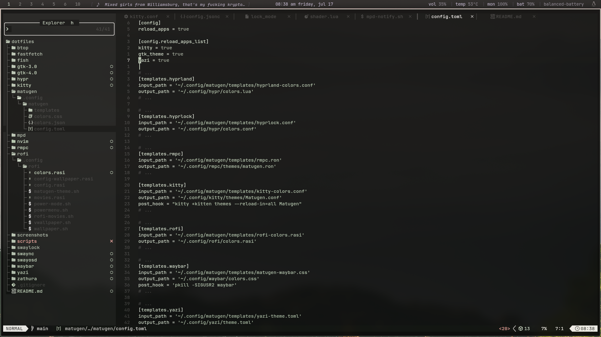
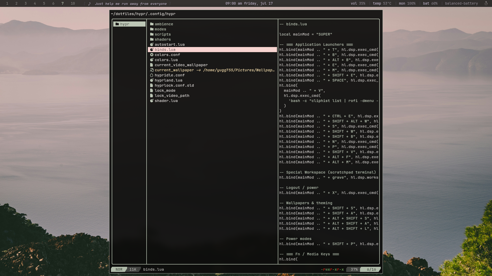
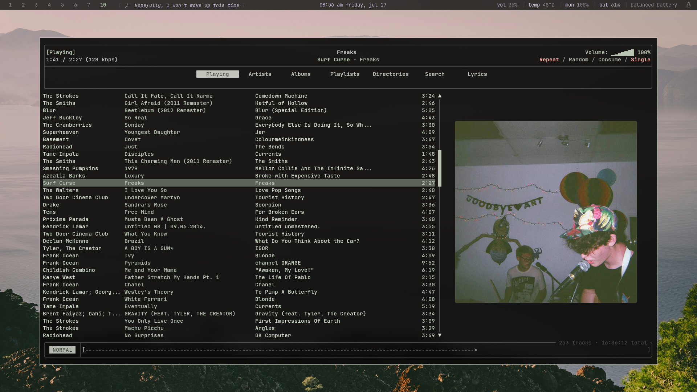
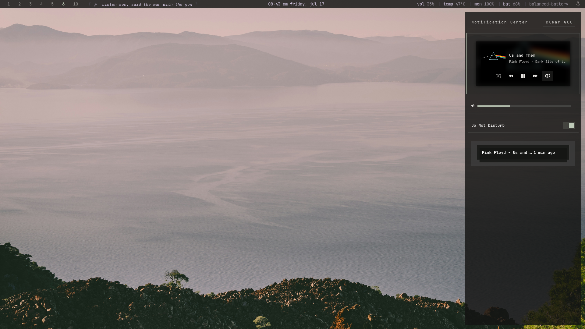

## personal-dotfiles

my personal linux setup and dotfiles.

## contents

- [screenshots](#screenshots)
- [components](#components)
- [structure](#structure)
- [requirements](#requirements)
- [installation](#installation)
- [keybinds](#keybinds)
- [shaders](#shaders)
- [wallpaper](#wallpaper)
- [credits](#credits)
- [notes](#notes)
- [reuse](#reuse)

## Screenshots

<p align="center">
  
</p>

<p align="center">
  
  
</p>

<p align="center">
  
  
</p>

## components

* **os** → Arch Linux
* **wm** → Hyprland 0.55+ (Lua configuration)
* **terminal** → Kitty
* **shell** → Fish
* **bar** → Waybar
* **launcher** → Rofi
* **notifications** → SwayNC
* **osd** → SwayOSD
* **editor** → Neovim
* **file manager** → Yazi + Nautilus
* **music** → MPD + rmpc
* **pdf viewer** → Zathura
* **colors** → Matugen
* **wallpaper** → awww
* **theming** → GTK
* **utilities** → btop, Fastfetch

## structure

```text
dotfiles/
├── btop
├── fastfetch
├── fish
├── gtk-3.0
├── gtk-4.0
├── hypr
├── kitty
├── matugen
├── micro
├── mpd
├── nvim
├── rmpc
├── rofi
├── scripts
├── swaync
├── swayosd
├── waybar
├── yazi
├── zathura
└── screenshots
```

## requirements

- Arch Linux (or another Arch-based distro)
- GNU Stow
- Hyprland 0.55+ (Lua configuration)

## installation

> [!NOTE]
> Some configs contain hardcoded paths and assumptions about my setup.
> I recommend copying only the configs you want and adapting them to your own system instead of applying the entire repository.

### clone the repository

```bash
git clone https://github.com/yugg755i/dotfiles.git
cd dotfiles
```

### install dependencies

```bash
sudo pacman -S hyprland kitty fish rofi waybar swaync swayosd yazi micro fastfetch btop mpd rmpc zathura stow python
```

aur packages:

* `matugen`
* `awww`
* `rofi-wayland`
* nerd fonts (`ttf-jetbrains-mono-nerd`)

### applying configs

I don't recommend applying the entire repository with `stow */`, especially if you're new to Hyprland.

Instead, copy or stow only the components you want and adapt them to your setup.

For example:

```bash
stow kitty
stow waybar
stow yazi
```

## keybinds

```text
SUPER + Shift + S    Wallpaper Picker
SUPER + Shift + A    Environment Modes
SUPER + Shift + P    Power Profiles
SUPER + Alt + M      Movie Launcher
SUPER + M            rmpc
SUPER + E            Yazi
SUPER + N            Notification Center
SUPER + Tab          Workspace Overview
SUPER + X            Power Menu
```
See [`hypr/.config/hypr/binds.lua`](./hypr/.config/hypr/binds.lua) for the complete list.

## shaders

Shader configuration is located in `hypr/shader.lua`.

```text
Alt + C              CRT Mode
SUPER + D            Reading Mode
SUPER + Alt + N      Night Light
SUPER + Alt + S      Disable All Shaders
```

## wallpaper

* https://walle.theblank.club
* https://github.com/dusklinux/images
* [current wallpaper](https://unsplash.com/photos/a-large-body-of-water-surrounded-by-mountains-1yFDsklbtBU)

## credits

* waybar and rofi: https://github.com/martin-djakovic/dotfiles
* Shaders: https://github.com/snes19xx/surface-dots

## notes

These dotfiles are built around my personal workflow and are shared as-is. They are intended as a reference or starting point.

## reuse

feel free to borrow, copy, or steal whatever you find useful.
