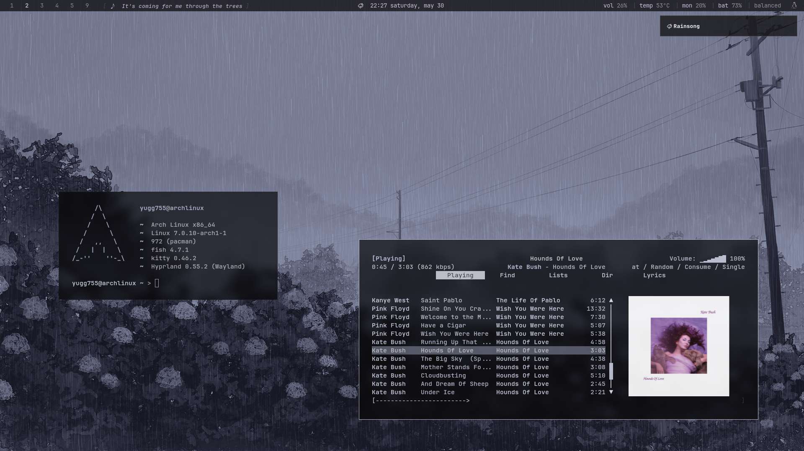
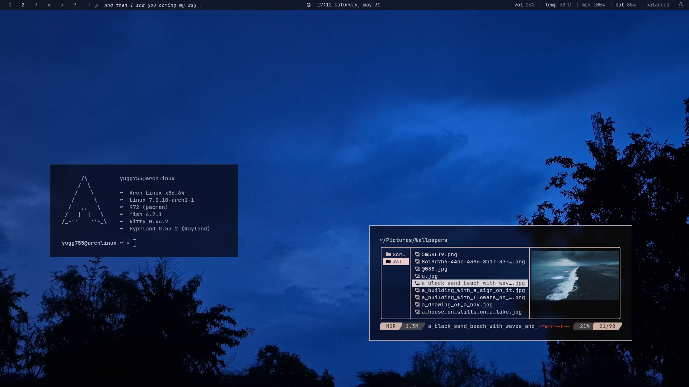
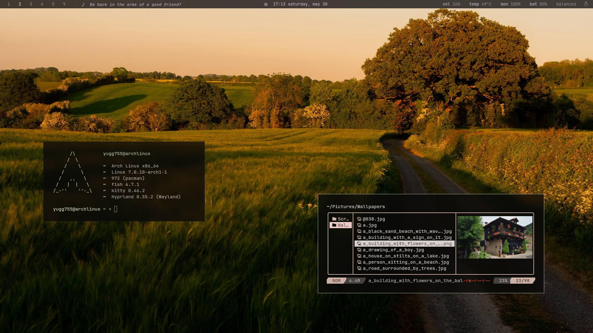
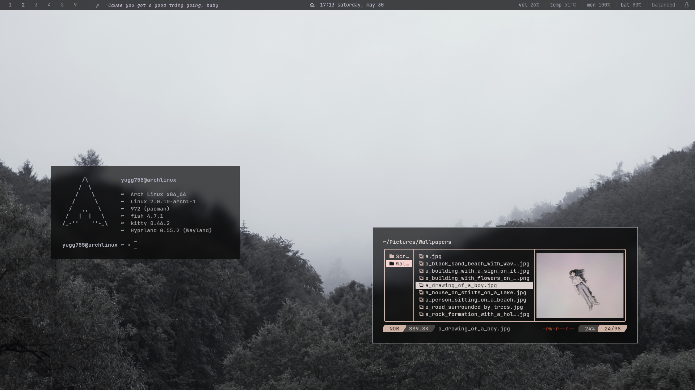

#  Cozy Setup, Refined
A mood-based Hyprland setup focused on a calm, immersive desktop experience.
Each mood switches the wallpaper, colors, and ambient sounds all at once.

## Moods

- Evergreen
- Rainsong
- Nocturne
- Golden Hour
- Mistveil
---

## Preview
### Modes Preview

### Evergreen

### Rainsong

### Nocturne

### Golden Hour

### Mistveil


---
## Components
- **OS** → Arch Linux
- **WM** → Hyprland
- **Terminal** → Kitty
- **Shell** → Fish
- **Bar** → Waybar
- **Launcher** → Rofi
- **Notifications** → SwayNC
- **OSD** → SwayOSD
- **Editor** → Micro / VSCode
- **File Manager** → Yazi + Nautilus
- **Music** → MPD + rmpc
- **PDF Viewer** → Zathura
- **Colors** → Matugen
- **Wallpaper** → awww
- **Theming** → GTK + Kvantum
- **Utilities** → btop, Fastfetch
---
## Features
- mood system — one keybind switches wallpaper, matugen colors, and ambient sounds
- live color theming across waybar, kitty, rofi, swaync, gtk, and more via matugen
- scrolling song lyrics in the bar pulled from lrclib
- rofi wallpaper picker with thumbnails
- animated wallpaper transitions with awww
- ambient sounds tied to each mood 
- media controls and notifications in swaync
- power modes (balanced, performance, battery)
---
## Structure
```
dotfiles/
├── btop
├── fastfetch
├── fish
├── gtk-3.0
├── gtk-4.0
├── hypr
├── kitty
├── matugen
├── micro
├── mpd
├── rmpc
├── rofi
├── scripts
├── swaync
├── swayosd
├── waybar
├── yazi
└── zathura
```
---
## Installation
### 1. Clone the repository
```bash
git clone https://github.com/yugg755i/dotfiles.git
cd dotfiles
```
### 2. Install dependencies
```bash
sudo pacman -S hyprland kitty fish rofi waybar swaync swayosd yazi micro fastfetch btop mpd rmpc zathura stow python
```
AUR packages needed:
- `matugen`
- `awww`
- `rofi-wayland`
- Nerd Fonts (e.g. `ttf-jetbrains-mono-nerd`)
### 3. Apply dotfiles using GNU Stow
```bash
stow */
```
### 4. Set up ambient sounds
- Download your preferred sounds and place them in `~/.config/hypr/ambience/`
- For example:

```txt
~/.config/hypr/ambience/forest/birds.mp3
~/.config/hypr/ambience/rain/rain.mp3
~/.config/hypr/ambience/night/crickets.mp3
```
---
## Wallpaper
- https://walle.theblank.club
- https://github.com/dusklinux/images
---
## Credits
- waybar and rofi inspiration — https://github.com/martin-djakovic/dotfiles
---
## Notes
these dotfiles are built around my personal workflow. some adjustments may be needed depending on your setup. 
