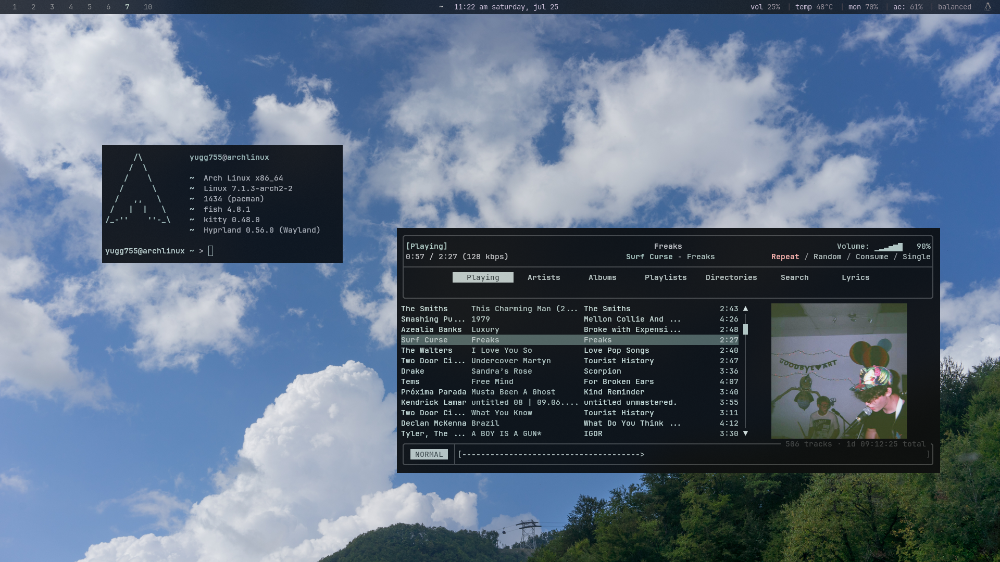

## dotfiles

My personal Linux setup and dotfiles.

## Screenshots

<p align="center">
  
</p>

## installation

> [!NOTE]
> Some configs contain hardcoded paths and assumptions about my setup. Copy or adapt only the components you want instead of applying the entire repository.

### requirements

- Arch Linux (or another Arch-based distro)
- GNU Stow
- Hyprland 0.55+ (Lua configuration)

### clone the repository

```bash
git clone https://github.com/yugg755i/dotfiles.git
cd dotfiles
```

### applying configs

copy or stow only the components you want and adapt them to your setup.

For example:

```bash
stow kitty
```

See [`hypr/.config/hypr/binds.lua`](./hypr/.config/hypr/binds.lua) for the complete list.

## shaders

Shader configuration is located in `hypr/shader.lua`.

```text
Alt + C              CRT Mode
SUPER + D            Reading Mode
SUPER + Alt + N      Night Light
SUPER + Alt + S      Disable All Shaders
```

## wallpaper

* https://walle.theblank.club
* https://github.com/dusklinux/images
* [current wallpaper](https://www.vecteezy.com/photo/3438146-mountain-landscape-on-background-of-blue-cloudy-sky)

## credits

* waybar and rofi: https://github.com/martin-djakovic/dotfiles
* shaders: https://github.com/snes19xx/surface-dots
